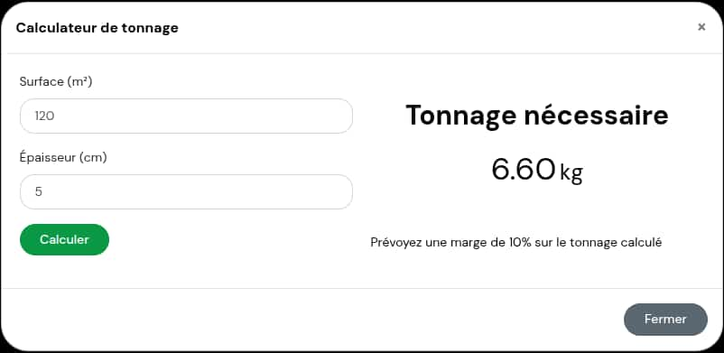

# Module Calcul Tonnage

Ce module Prestashop permet de calculer le tonnage (poids) de gravier nécessaire en fonction de la surface et de l'épaisseur désirée, pour des produits dont la densité est spécifiée.

## Fonctionnalités

- Affiche un bouton "Calcul de tonnage" sur les pages produit
- Ouvre une fenêtre modale permettant de saisir la surface et l'épaisseur
- Calcule automatiquement le tonnage selon la formule : densité × surface × épaisseur
- Configuration simple permettant de choisir la caractéristique produit contenant la valeur de densité

## Installation

1. Téléchargez le module
2. Décompressez-le dans le dossier `/modules` de votre installation Prestashop
3. Installez le module depuis le back-office de Prestashop
4. Configurez la caractéristique produit qui contient la valeur de densité

## Configuration requise

- Prestashop 8.0 ou plus récent
- PHP 8.2 ou plus récent
- Bootstrap 4

## Utilisation

1. Créez une caractéristique produit pour stocker la densité de vos produits
2. Attribuez cette caractéristique à tous les produits concernés avec la valeur de densité appropriée
3. Dans la configuration du module, sélectionnez cette caractéristique
4. Le bouton de calcul de tonnage apparaîtra sur les pages des produits ayant une densité définie

## Screenshot

